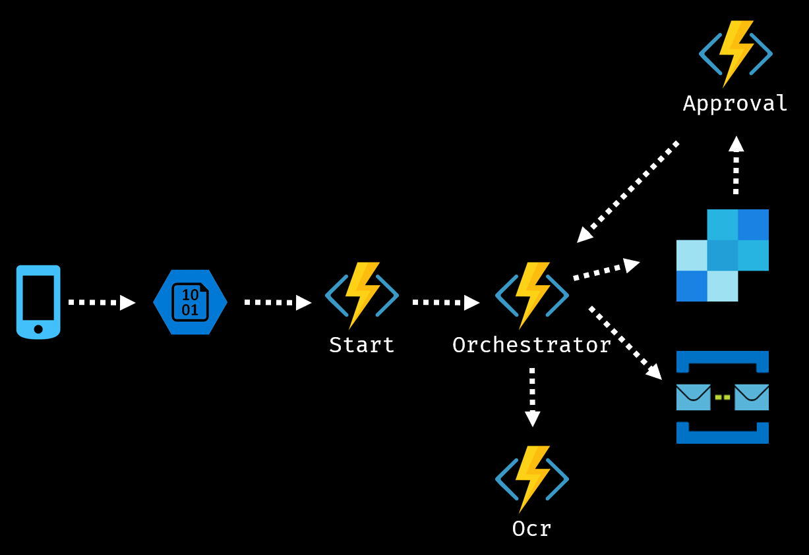

Kvitton-Demo2
=============

The idea is this durable function simuates a non trivial workflow.

The device takes an image of a receipt (or not) this is uploaded to Azure blob storage. This is simulated by using the storage explorer.

The `Starter` function is triggered by the blob event and starts the `Orchestrator` function. 

This orchestrator calls the Activity Function `GetTextFromImage` and goes to sleep. 

`GetTextFromImage` calls the `ComputerVisionApi` (you need a free api key for this). When the scanned text is returned the `orchestrator` checks the text and decides if this is a valid receipt. If it is, the receipt is sent to accounting (through a log message). 

If it is not, an email (again, sent through the log) is sent to actuall person that checks the image and decides if this is a valid receipt. (all this is faked, just look for the `instanceId` that is outputted). 

The person then klicks either the approve link och the approve link or the dissaprove link in the message. This triggers a HTTP call to the approval function, including the `instanceId`. To call this function locally just post to http://localhost:7071/api/approval/{instanceId} and the receipt should be approved.

To run this you need to update the settings in `local.settings.json` to something that works for you. Get a free Azure account and use those settings!